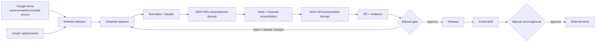

# ADR-0002 — DDS Venezuela governance control plane

- Status: Proposed for Manuel approval
- Date: 2026-10-02
- Oreshnik anchor: Cerberux77/oreshnik#233
- Implementation branch: `run/dds-s06-governance-01`

## Context

DDS Venezuela has commercial/documental sources in Google Drive, application source in `Cerberux77/DDS-VEN`, an existing Oreshnik control plane, a controlled web deal room and external communication through Gmail. The primary governance risk is not lack of storage; it is silent substitution of baselines, duplicated calculation logic, uncontrolled propagation of drafts, and outbound commitments without an explicit human gate.

The current connected GitHub installation exposes `Cerberux77/DDS-VEN` and does not expose a separate `dds-venezuela-deal-room` repository. The existing deal-room application has already been migrated into `DDS-VEN`.

## Decision

Do **not** create a third repository and do **not** split the current repository merely to match a conceptual diagram.

Use the existing `DDS-VEN` repository with two explicit logical domains until a real ownership, deployment or security boundary justifies a physical split:

1. **Computational domain** — technical rules, normalized equipment/AFE inputs, scenario engine, financial logic, tests, schemas and reconciliation.
2. **Presentation domain** — Next.js controlled deal room, HTML/visual configurator, previews and access controls.

A future `dds-venezuela-deal-room` repository is permitted only if all of the following are true: independent deployment lifecycle, independent access ownership, no duplicated financial logic, a versioned interface/manifest between repositories, and a migration plan that leaves one computational source of truth.

## System map

## Canonical responsibilities

### Google Drive

Source of truth for AFE, contracts, NDA, approved deliverables, minutes, approved Excel, identity manual and other commercial/documental originals. Original sensitive files stay in Drive unless a specific Git policy permits a normalized or derived representation.

### DDS-VEN

Source of truth for executable calculation rules and tests. Git may store metadata, schemas, normalized non-sensitive inputs and derived non-sensitive artifacts. Git must not become a bulk mirror of Drive.

### Oreshnik

Control plane for task/run identity, change detection evidence, gate state, PR workflow, reconciliation and release control. Oreshnik does not become a second copy of application source or Drive originals.

### Deal room

Presentation/access layer. Browser clients receive only approved/derived previews according to existing server-side access policy. No private Drive/source credentials are exposed to the browser.

### Gmail

External communication surface. Automation may prepare drafts. Economic, legal, contract, AFE and partner-commitment sends require explicit Manuel approval.

## Drive sync strategy

Sync is an allow-list operation, not folder replication.

Every monitored record carries, when available:

- `driveFileId`
- `canonicalPath`
- `version`
- `modifiedTime`
- `hash`
- `documentType`
- `status`
- `gitPolicy`
- `relatedModelInput`
- `relatedRelease`

A missing hash is explicit evidence, not an invented value. A file that appears inside a monitored folder is **not** automatically authorized for ingestion.

## Lifecycle policy

- **CURRENT** — the sole active baseline for a document type. Replacing it is a material promotion and requires Manuel approval.
- **APPROVED** — approved artifact or release candidate that is not the active baseline.
- **DRAFT** — work in progress; never substitutes CURRENT.
- **SUPERSEDED** — previously valid but replaced; read-only historical evidence.
- **ARCHIVE** — historical/non-operational material; excluded from active navigation and model ingestion.

Folder naming is supporting evidence, not authority. Status metadata and gates decide promotion.

## Git policy

- **METADATA_ONLY** — store identifiers/metadata only.
- **NORMALIZED_INPUT** — store a normalized non-sensitive representation, not the original.
- **DERIVED_ARTIFACT** — store a generated non-sensitive artifact.
- **DO_NOT_COPY** — keep original/source bytes outside Git.

Legal, contractual and confidential originals default to `DO_NOT_COPY`.

## Required gates

Every monitored source change:

1. SOURCE_WHITELIST
2. LIFECYCLE_STATUS
3. EVIDENCE_CAPTURE

If the record feeds the economic model:

4. NORMALIZE_INPUT
5. MODEL_TESTS
6. FINANCIAL_RECONCILIATION

If the candidate would become CURRENT:

7. MANUEL_BASELINE_APPROVAL

For release:

8. PR_REVIEW
9. CI
10. RELEASE_EVIDENCE

For sensitive external communication:

11. MANUEL_OUTBOUND_APPROVAL

Draft generation may occur before gate 11. Send may not.

## Permission model

| Actor | Drive | DDS-VEN | Oreshnik | Deal room | Gmail |
|---|---|---|---|---|---|
| Detector/sync | read metadata + whitelisted content only | branch/PR only | create/update task evidence | none | read specific inbound only when required |
| Model worker | normalized inputs only | branch/PR; no direct main | run/gate evidence | none | none |
| Deal-room runtime | no Drive browsing | deployed presentation code | audit reference only | server-side controlled access | none |
| Communication worker | approved release summary only | read release metadata | read gate result | none | draft-only intent |
| Manuel | full business authority | review/merge | approve material gates | admin/release authority | explicit send approval |

Secrets remain server-side and are never written into Git, evidence JSON or browser payloads.

## Observability record

For every governed event retain:

- source changed;
- what changed;
- financial impact;
- affected outputs;
- tests and results;
- approver;
- release/version;
- evidence references.

The schema is `schemas/governance/change-evidence.schema.json`.

## Identity system

The full Mantis manual is not injected into every run. Reusable brand rules are extracted to `config/brand/smsmantis.tokens.json`. The source manual remains in Drive.

## Consequences

Positive:

- Drafts cannot silently become baselines.
- Drive remains authoritative for commercial originals without turning Git into a document dump.
- Calculation logic remains testable and reproducible.
- External commitments preserve human control.
- The existing deal-room security boundary is preserved.

Trade-offs:

- A whitelist requires maintenance.
- Hashing may remain pending when the connected Drive surface does not expose a checksum.
- S01–S05 computational outputs must be integrated into the computational domain before S06 can calculate a real AFE financial delta automatically.
